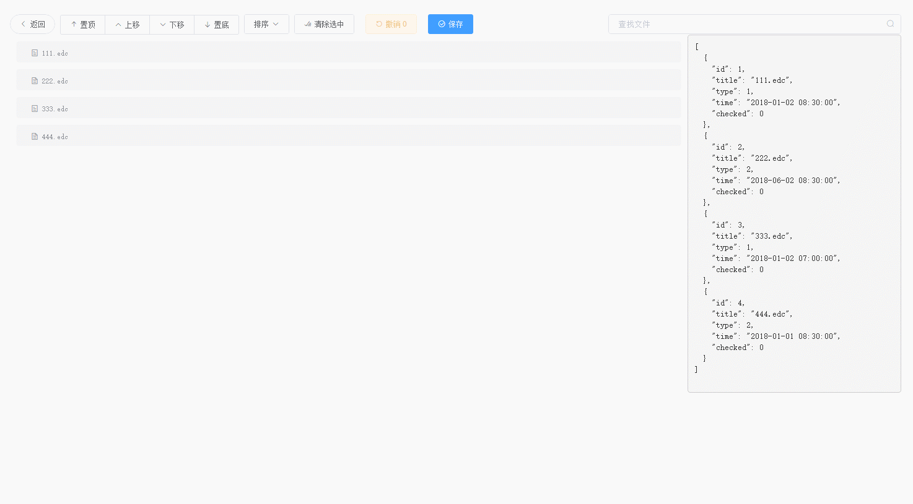

# FileSort 文件列表排序

> 利用Vue.js Element-ui sortablejs实现了文件列表排序的单页应用

## 效果图


## 环境依赖

`Node >= 6`

```
"axios": "^0.19.2",
"element-ui": "^2.3.4",
"vue": "^2.5.16",
"qs": "^6.9.4",
"sortablejs": "^1.10.2"
```

## 安装

 - Clone or download this repository
 - Enter your local directory, and install dependencies:

``` bash
yarn
```

## 开发

``` bash
# serve with hot reload at localhost:8010
npm run dev
```

### 数据格式

#### 文件列表数据
```
{
    "id":1,
    "title":"111.edc",
    "time":"2020-07-09 11:43:00",
    "type":1
}
```
|字段|说明|
|-|-|
|id|文件id|
|title|文件标题|
|time|文件生成时间|
|type|文件类型,我的项目中1:电子原件,2:纸质原件,3:纸质复印件|

> 实现数据接口给的文件列表需要包含以上字段

#### 保存提交数据
```
[
    {
        "id":2,
        "sno":1
    },
    {
        "id":1,
        "sno":2
    }
]
```
> sno表示排序序号

### 配置
|参数|类型|说明|
|-|-|-|
|DEBUG|boolean|调试模式开关,开启调试后不请求接口数据,仅用测试数据,右侧展示数据结果;保存操作也不提交给保存接口,仅展示提交数据结构|
|GET_ITEMS_URL|string|初始化文件列表请求接口|
|SET_ITEMS_URL|string|保存文件排序请求接口|


## 构建

``` bash
# build for production with minification
npm run build
```
